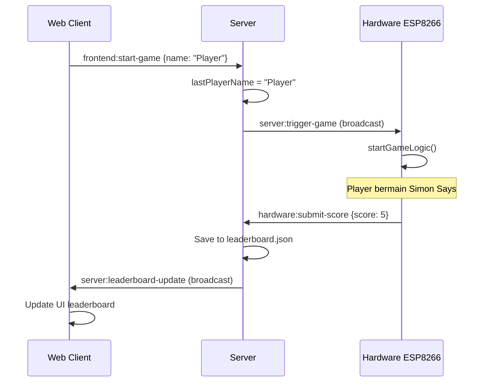

# 🎮 Simon Says IoT System

Sistem permainan Simon Says yang terintegrasi dengan IoT menggunakan NodeMCU ESP8266, dengan komunikasi real-time antara perangkat keras, server backend, dan klien web.

## 📋 Gambaran Umum

Sistem ini terdiri dari tiga komponen utama:

1. **🖥️ Backend Server (Node.js)** - Mengelola komunikasi real-time dan data papan peringkat
2. **🌐 Frontend Web Client** - Interface untuk memulai permainan dan melihat leaderboard
3. **🔧 Hardware ESP8266** - Perangkat fisik yang menjalankan permainan Simon Says

## 🏗️ Arsitektur Sistem

```
┌─────────────────┐    WebSocket     ┌─────────────────┐    WebSocket     ┌─────────────────┐
│   Web Client    │ ◄───────────────► │  Backend Server │ ◄───────────────► │  ESP8266 MCU    │
│                 │                   │                 │                   │                 │
│ • Input nama    │   HTTP API        │ • Socket.IO Hub │   WiFi            │ • LEDs (4x)     │
│ • Mulai game    │ ◄───────────────► │ • Leaderboard   │                   │ • Buttons (4x)  │
│ • Lihat skor    │                   │ • State mgmt    │                   │ • Buzzer        │
└─────────────────┘                   └─────────────────┘                   └─────────────────┘
```

## 🚀 Quick Start

### 1. Setup Backend Server

```bash
# Install dependencies
npm install

# Start development server
npm run dev

# Start production server
npm start
```

Server akan berjalan di `http://localhost:3000`

### 2. Setup Hardware ESP8266

1. **Install Arduino Libraries:**
   - `ArduinoJson` by Benoit Blanchon (v6.x)
   - `SocketIOClient` by Tuan PM

2. **Wiring Diagram:**
   ```
   ESP8266 NodeMCU:
   ├── D5 → LED Red
   ├── D6 → LED Green
   ├── D7 → LED Blue
   ├── D8 → LED Yellow
   ├── D1 → Button Red
   ├── D2 → Button Green
   ├── D3 → Button Blue
   ├── D4 → Button Yellow
   └── D0 → Buzzer
   ```

3. **Upload Code:**
   - Buka `simon_says_esp8266.ino` di Arduino IDE
   - Sesuaikan kredensial WiFi di bagian konfigurasi
   - Upload ke NodeMCU ESP8266

### 3. Akses Web Interface

Buka browser dan navigasi ke `http://localhost:3000`

## 🎯 Cara Bermain

1. **Mulai Permainan:**
   - Masukkan nama pemain di web interface
   - Klik tombol "Mulai Permainan"
   - Perangkat ESP8266 akan menerima trigger dan mulai menampilkan urutan

2. **Bermain:**
   - Perhatikan urutan LED yang menyala di perangkat fisik
   - Tekan tombol yang sesuai dengan urutan yang ditampilkan
   - Setiap putaran akan menambah satu warna baru ke urutan

3. **Game Over:**
   - Jika salah menekan tombol atau timeout (10 detik)
   - Animasi kalah akan ditampilkan
   - Skor otomatis terkirim ke leaderboard
   - Leaderboard web akan update secara real-time

## 🔄 Alur Komunikasi Event



## 📁 Struktur File

```
/
├── index.js              # Server utama
├── package.json          # Dependencies
├── simon_says_esp8266.ino # Kode Arduino
├── data/
│   └── leaderboard.json  # Data papan peringkat
└── public/
    ├── index.html        # Frontend HTML
    ├── style.css         # Styling
    └── script.js         # Frontend JavaScript
```

## 🔧 Konfigurasi

### Server Configuration

```javascript
// Default port: 3000
const PORT = process.env.PORT || 3000;
```

### ESP8266 Configuration

```cpp
// WiFi Credentials
const char* ssid = "Bapakmu Ijo";
const char* password = "irengputeh";

// Server Host (update sesuai deployment)
const char* socket_io_host = "your-server-host.com";
const uint16_t socket_io_port = 80;
```

## 🌐 Deployment ke Azure

1. **Prepare for Azure:**
   ```json
   // package.json
   "scripts": {
     "start": "node index.js"
   },
   "engines": {
     "node": ">=14.0.0"
   }
   ```

2. **Deploy:**
   - Push code ke GitHub repository
   - Connect Azure App Service ke repository
   - Set environment variables jika diperlukan

3. **Update ESP8266:**
   - Ganti `socket_io_host` dengan URL Azure App Service
   - Re-upload code ke ESP8266

## 🔍 API Endpoints

### GET /api/leaderboard
Mendapatkan data papan peringkat yang sudah diurutkan.

**Response:**
```json
[
  {
    "name": "John",
    "score": 8,
    "timestamp": "2024-01-01T12:00:00.000Z"
  }
]
```

## 🧪 Testing

### Test Backend
```bash
# Install dependencies
npm install

# Start server
npm run dev

# Test API endpoint
curl http://localhost:3000/api/leaderboard
```

### Test Frontend
1. Buka `http://localhost:3000`
2. Masukkan nama dan klik "Mulai Permainan"
3. Cek console browser untuk WebSocket events

### Test Hardware
1. Monitor Serial Output di Arduino IDE
2. Pastikan koneksi WiFi berhasil
3. Pastikan Socket.IO terhubung ke server
4. Test manual dengan menekan tombol

## 🐛 Troubleshooting

### Backend Issues
- **Port already in use:** Change PORT in environment variables
- **CORS errors:** Ensure Socket.IO client connects to correct host
- **File permission errors:** Check write permissions for `data/` directory

### Hardware Issues
- **WiFi connection failed:** Double-check SSID and password
- **Socket.IO connection failed:** Verify server URL and port
- **LEDs not working:** Check wiring and pin configurations
- **Buttons not responsive:** Verify pull-up resistors and debounce logic

### Frontend Issues
- **Connection failed:** Ensure server is running and accessible
- **Leaderboard not updating:** Check browser console for WebSocket errors
- **Button disabled:** Check connection status and input validation

## 📊 Monitoring & Logs

### Server Logs
```bash
# Development
npm run dev

# Production (with PM2)
npm install -g pm2
pm2 start index.js --name simon-says
pm2 logs simon-says
```

### Hardware Logs
Monitor Serial Output di Arduino IDE (9600 baud rate)

## 🔒 Security Considerations

- Sanitize user input untuk nama pemain
- Rate limiting untuk prevent spam requests
- Validate score data dari hardware
- HTTPS recommended untuk production

## 📈 Future Enhancements

- [ ] Multiple difficulty levels
- [ ] Sound effects di web interface
- [ ] Player authentication
- [ ] Game statistics dan analytics
- [ ] Multiple hardware devices support
- [ ] Tournament mode
- [ ] Mobile app companion

## 📞 Support

Jika mengalami masalah:

1. Cek troubleshooting section
2. Monitor logs untuk error messages
3. Verify semua connections dan configurations
4. Test individual components secara terpisah

## 📄 License

Proyek ini dibuat untuk keperluan akademik dan pembelajaran IoT.

---

**Dibuat dengan ❤️ untuk pembelajaran IoT dan Real-time Systems** 